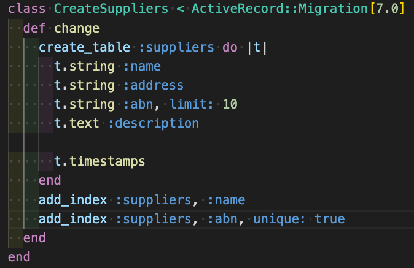

# README

## Getting Started

[Rails Repo](https://github.com/rails/rails.git)
[Rails 7](https://rajeevkannav.com/post/2021-03-19-install-rails7-alpha-edge/)
[Rails 7 alt](https://sapidlabs.com/rails/2021/06/12/how-to-install-rails-7.html)

## Goals

- [DONE] Create a model in the database

```
rails g model supplier name:string:index address:string abn:string{10}:uniq description:text
rails g model supplier name:string:index address:string abn:string:uniq description:text

rake db:migrate
rake db:migrate RAILS_ENV=test
```


- [FAILED] Scaffod CRUD operations for model

```
rails generate scaffold supplier
```

- [DONE] Annotate models

```
annotate --models -p bottom
```

- [DONE] Add Rspec
- [DONE] Create an Spec Tests
- [DONE] Add FactoryBot
- [DONE] Add Guard
- [DONE] Automate Rspec
- [DONE] Add Cops
- [DONE] Create and publish a Git Repo
- Watch 2 Videos on Rails 7
- Sean to Get clone the repo
- Go over the schema.rb from noquue
- Devise (Security)


